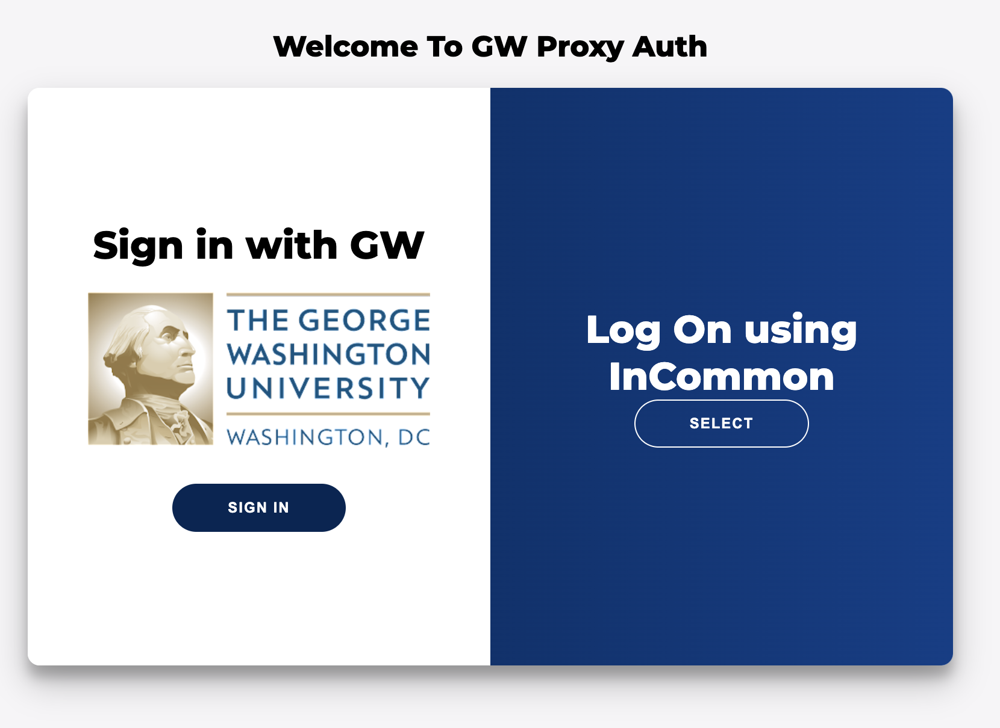
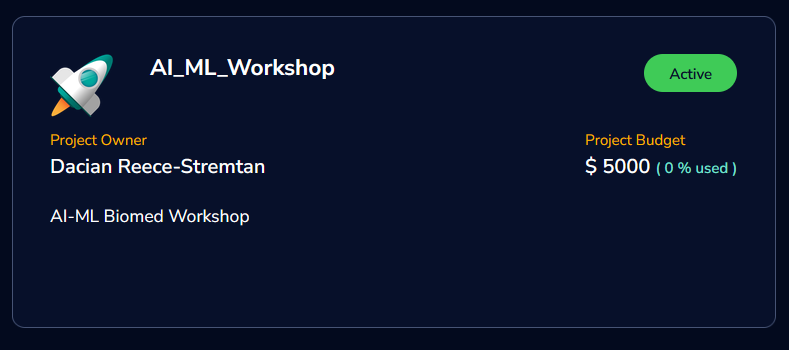
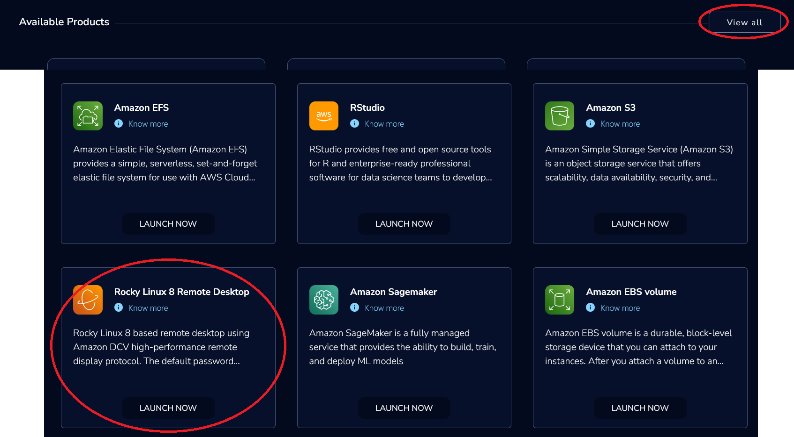
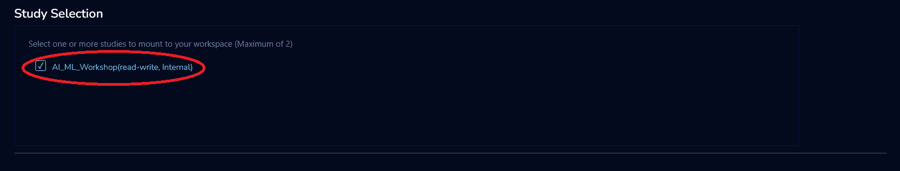
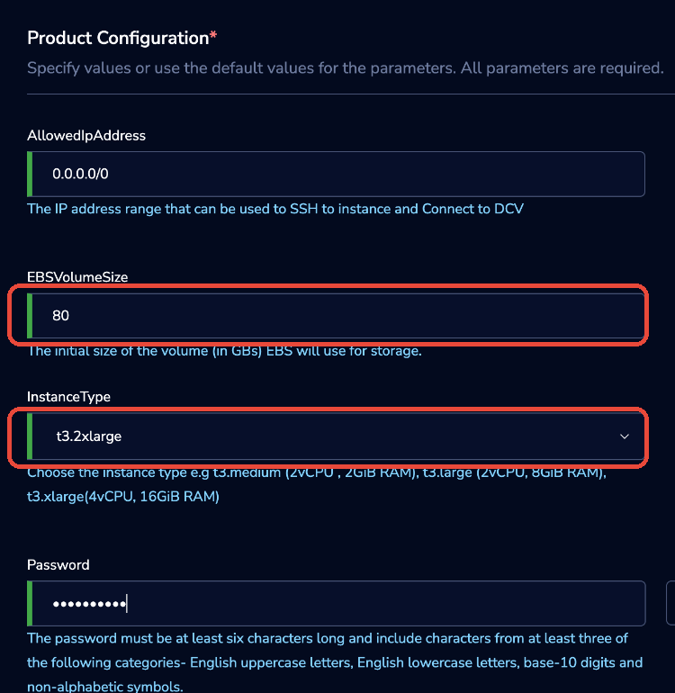
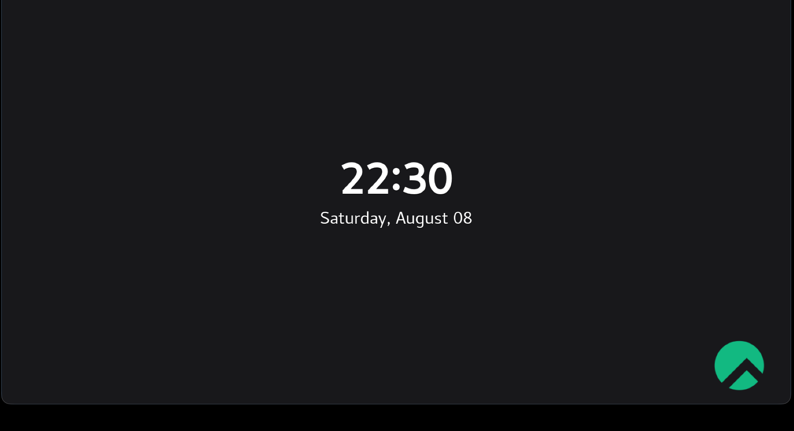

# AI in Biomed Boot Camp — Pre-Bootcamp Setup

This guide gets your cloud environment working **before** the bootcamp so we can spend our time on AI and biomedical computing instead of setup. It walks you through logging into **GW Research Gateway (AWS)**, launching a **Rocky Linux 8 Remote Desktop**, starting **Jupyter**, and pulling the model with **Ollama**.

> **Why AWS and not Pegasus?** Pegasus's GPFS storage is unavailable for the bootcamp window. Research Gateway gives everyone a full Linux desktop today, and every skill we use — Jupyter, PyTorch, Ollama, bash, Python environments — transfers directly. The main thing that does not carry over is Slurm, which we do not need for this bootcamp.

**Plan for about 30 minutes.** The instance itself takes ~15 minutes to build, so start early.

---

## What you'll accomplish

By the end you should have all of these done:

- [ ] Signed in to Research Gateway at **rg.arc.gwu.edu**
- [ ] Launched a **Rocky Linux 8 Remote Desktop** (80 GB storage, `t3.2xlarge`)
- [ ] Logged into the desktop and opened a terminal
- [ ] Started **Jupyter** from a Python virtual environment
- [ ] Opened and run **`ollama_aws.ipynb`**, including pulling the model

Come to the bootcamp with all five checked.

---

## What's in this repo

- **`README.md`** — the pre-bootcamp setup guide
- **`ollama_aws.ipynb`** — the main notebook for Research Gateway / AWS
- **`ollama_colab.ipynb`** — the Colab version of the same exercise
- **`images/`** — screenshots used in the setup walkthrough

---

## Before you start

- **Your first login.** The very first time you sign in, the portal shows a **"requires admin approval"** message. This is normal — but until an admin approves you, you can't launch anything. Logging in early means approval is already granted when you need it.
- **Confirm you're on the `AI_ML_Workshop` project.** If you don't see it after signing in, contact the organizers before the session.
- Use a current browser (Chrome works well). You'll end up with two tabs: the portal and your remote desktop.

---

## Step 1 — Sign in to Research Gateway

1. Go to **https://rg.arc.gwu.edu/**
2. Click **InCommon-Login**.
3. On the next screen, choose **Sign in with GW** and authenticate with your GW credentials.




> **First login?** You'll see a message that your account **requires admin approval**. That's expected. Once it's granted you'll land on the projects screen.

---

## Step 2 — Open the AI_ML_Workshop Project

From **My Projects**, open the **AI_ML_Workshop** project card.



---

## Step 3 — Selecting the Product

Go to the **Available Products** tab, click **View all**, scroll down and select **Rocky Linux 8 Remote Desktop**.

> ⚠️ There are look-alikes in the list — **Rocky Linux 8 EC2** and **Windows Remote Desktop**. Make sure you pick **Rocky Linux 8 Remote Desktop** (as circled below).



---

## Step 4 — Configuration and Launch

Give the product a name (letters, numbers, dots, hyphens, and underscores only — no spaces), then scroll down and set:

| Setting | Value |
|---|---|
| **Product Name** | Anything memorable, e.g. `MyAWSInstance` |
| **Study Selection** | Check "AI_ML_Workshop", **this is absolutely required** |
| **EBSVolumeSize** | **80** (GB) |
| **InstanceType** | **`t3.2xlarge`** |
| **Password** | Choose your own — you'll use it to log into the desktop |

Then click **Launch Now**.





> ⏱ **Expected provisioning time is about 15 minutes.** You can keep working in the portal or step away while it builds.
>
> 🔒 **About the password:** you set your own password here. Ignore any pre-filled default shown on the product description — pick something only you know.
> 
> ❗ **Please make sure to remember this password**, as there's no way to reset it without simply requesting an entire new instance.

---

## Step 5 — Logging into the Desktop

When the instance is ready, it opens in a **new browser tab** showing a Rocky Linux lock screen.

1. Log in with the **password you created** in Step 4.
2. If you don't see a password box, **click inside the window and drag upward** to reveal it.



---

## Step 6 — Jupyter Setup and Startup

Open a **terminal** on the desktop and run these commands one at a time:

```bash
sudo dnf install python3.12 -y
python3.12 -m venv my_new_env
source my_new_env/bin/activate
pip install notebook
jupyter notebook
```

A Jupyter notebook will open in a browser **inside the remote desktop**.

> **Important:** the virtual environment must be active (the `source my_new_env/bin/activate` line) *before* you run `jupyter notebook`. If you open a new terminal later, run that `source` line again first.

---

## Step 7 — Run the Ollama Notebook

In the Jupyter file browser, open:

```
./studies/ProjectStorage/ollama_aws.ipynb
```

Run the notebook top to bottom. **Run the model-pull cell early** — the download takes a while, and running it now means the model is ready before the bootcamp instead of during it. When a later cell gets a response from the model, you're done.

---

## Troubleshooting

| Problem? | Try this! |
|---|---|
| **Login fails** | Re-check the InCommon / Sign in with GW steps. If it's your first login, your account may still be waiting on **admin approval**. |
| **Nothing to launch / no project** | Confirm you're a member of the **AI_ML_Workshop** project and that it shows a budget. Contact the organizers if it's missing. |
| **Instance won't launch** | Double-check the config: **80 GB** storage and **`t3.2xlarge`**. Make sure the product name has no spaces or special characters. |
| **Can't find the password box** | Click in the desktop window and **drag upward** to reveal it. |
| **`jupyter: command not found`** | The virtual environment isn't active. Run `source my_new_env/bin/activate`, then `jupyter notebook` again. |
| **Package or model missing** | Re-run the `pip install` / model-pull cells with the venv active. |

---

## Getting Help

- **RTShelp** — for account, access, and system issues.
- **Office Hours** — bring anything you could not get working before the session.

Please sort out access **before** the bootcamp so we don't spend session time on setup.

---

## Please: stop your instance when you're done!

The `t3.2xlarge` instance bills against the shared **$5,000 AI_ML_Workshop project budget** the whole time it's running. When you finish for the day, **stop your instance** from the portal so it isn't quietly burning the budget.

---

## Quick Reference

```text
Portal:     https://rg.arc.gwu.edu/   →  InCommon-Login  →  Sign in with GW
Project:    AI_ML_Workshop
Product:    Rocky Linux 8 Remote Desktop
Config:     80 GB storage  ·  t3.2xlarge  ·  your own password
Notebook:   /home/ec2-user/studies/ProjectStorage/ollama_aws.ipynb
```

```bash
# On the desktop, in a terminal:
sudo dnf install python3.12 -y
python3.12 -m venv my_new_env
source my_new_env/bin/activate
pip install notebook
jupyter notebook
```
